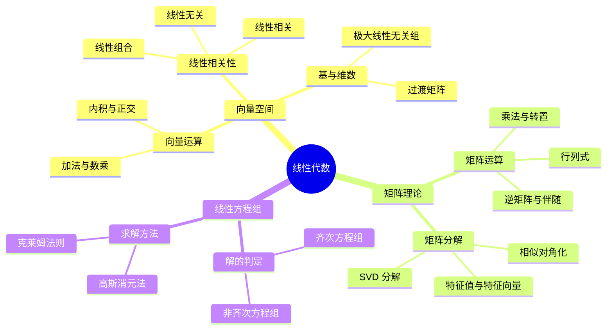

# 数学基础

```mermaid

mindmap
  root((线性代数))
    向量空间
      向量运算
        加法与数乘
        内积与正交
      线性相关性
        线性组合
        线性相关
        线性无关
      基与维数
        极大线性无关组
        过渡矩阵
    矩阵理论
      矩阵运算
        乘法与转置
        行列式
        逆矩阵与伴随
      矩阵分解
        特征值与特征向量
        相似对角化
        SVD 分解
    线性方程组
      解的判定
        齐次方程组
        非齐次方程组
      求解方法
        高斯消元法
        克莱姆法则

```