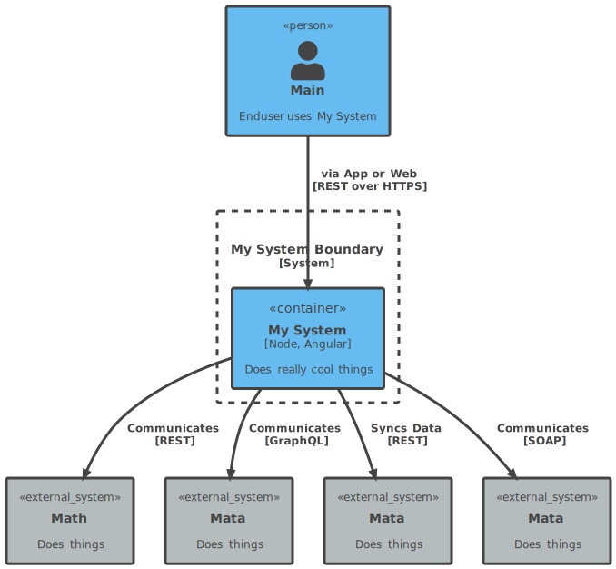

# 目录

> 数据来源

* [CSDIY](https://csdiy.wiki/)

- [必学工具](必学工具.md)

- [好书推荐](好书推荐.md)

- [数学基础](数学基础.md)

- [数学进阶](数学进阶.md)
  
- [编程入门](编程入门.md)
  
- [电子基础](电子基础.md)
  
- [数据结构与算法](数据结构与算法.md)

- [软件工程](软件工程.md)

- [体系结构](体系结构.md)

- [操作系统](操作系统.md)

- [并行与分布式系统](并行与分布式系统.md)

  